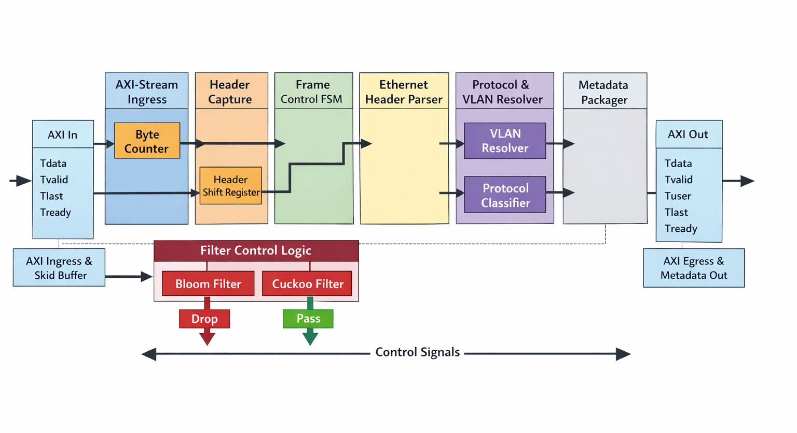

<h1 align="center">
AXI-Stream Ethernet Frame Parser & Metadata Extraction Subsystem
</h1>
<p align = center>
A cycle-accurate, streaming Ethernet Layer-2 parser implemented in synthesizable SystemVerilog, validated on Artix-7 FPGA hardware and architected for deterministic AXI4-Stream compliance and ASIC portability.
</p>
<br>


<div align="center">

   

-blueviolet)     

  


</div>


---

## 1. Purpose

This repository contains a streaming Ethernet Layer-2 frame parser implemented in SystemVerilog, designed for integration into FPGA- and SoC-class data-plane pipelines.

The subsystem accepts Ethernet frames over an AXI4-Stream interface, performs deterministic header decoding, and emits structured metadata aligned with the payload stream.

The design is suitable for:

- Hardware firewall front-ends  
- Packet classification engines  
- Network acceleration pipelines  
- FPGA prototyping platforms  
- Pre-ASIC RTL integration  

---

## 2. Scope

The subsystem performs:

- Ethernet II header parsing  
- Optional IEEE 802.1Q single-tag VLAN resolution  
- L3 protocol classification (IPv4, IPv6, ARP, Unknown)  
- Transparent payload forwarding  

The subsystem does **not**:

- Validate CRC/FCS  
- Perform deep packet inspection  
- Modify payload contents  
- Correct malformed AXI protocol violations  

---

## 3. System Partitioning



<p align="center">
  <em>Figure 1 — Logical separation between board wrapper, parser core, and downstream logic.</em>
</p>

The parser core contains:

- No board-level primitives  
- No device-specific clocking  
- No vendor-specific IP dependencies  

This ensures portability across FPGA platforms and ASIC-oriented flows.


The project is structured into three isolated layers to enforce separation of concerns.

| Layer | Responsibility | Location |
|--------|----------------|----------|
| Board Wrapper | Clocking, reset synchronization, FPGA I/O, ILA debug | `rtl/top_ax7203.sv` |
| Parser Core | AXI4-Stream frame parsing and metadata generation | `rtl/ethernet_frame_parser.sv` |
| Verification Layer | Unit and integration testbenches | `tb/` |
---

## 4. Architectural Constraints

The subsystem is implemented under the following non-negotiable constraints:

| Constraint | Description |
|------------|------------|
| Single-pass parsing | Headers decoded as bytes arrive; no full-frame buffering |
| AXI compliance | `tvalid`, `tready`, and `tlast` semantics preserved |
| Backpressure safety | No data loss under downstream stall |
| Deterministic metadata timing | Metadata aligned with first payload beat |
| Synthesis safety | No inferred latches, no ambiguous FSM behavior |


## 5. High-Level Architecture

<p align="center">
  
</p>

<p align="center">
  <em>Figure 2 — Stage-partitioned streaming architecture of the AXI-Stream Ethernet parser.</em>
</p>


The subsystem is implemented as a stage-partitioned streaming pipeline.  
Each stage has a single functional responsibility and preserves AXI-Stream semantics.

### 5.1 Dataflow Overview

<p align="center">
  
</p>

<p align="center">
  <em>Figure 3 — Internal datapath connectivity and control signal propagation.</em>
</p>


### 5.2 Design Characteristics

| Attribute | Implementation Strategy |
|------------|-------------------------|
| Header storage | Shift-register based, fixed depth |
| Backpressure isolation | Single-beat skid buffer |
| Phase control | Explicit FSM (IDLE → HEADER → PAYLOAD) |
| Metadata emission | Single-cycle valid pulse per frame |
| Payload handling | Transparent forwarding |

The pipeline guarantees one AXI word per cycle throughput under sustained `tready`.

<p align="center">
  
</p>

<p align="center">
  <em>Figure 4 — Module-level interaction and separation between control and datapath.</em>
</p>


---

## 6. Interface Specification

### 6.1 AXI4-Stream Data Interface

The parser exposes a standard AXI4-Stream interface.

#### Ingress Interface

| Signal | Direction | Description |
|--------|----------|-------------|
| `s_axis_tdata` | Input | AXI payload data |
| `s_axis_tvalid` | Input | Data valid indicator |
| `s_axis_tready` | Output | Backpressure signal |
| `s_axis_tlast` | Input | End-of-frame indicator |

#### Egress Interface

| Signal | Direction | Description |
|--------|----------|-------------|
| `m_axis_tdata` | Output | Forwarded payload data |
| `m_axis_tvalid` | Output | Output valid |
| `m_axis_tready` | Input | Downstream backpressure |
| `m_axis_tlast` | Output | End-of-frame |

### 6.2 AXI Contract

The following guarantees are enforced:

- `tdata` remains stable when `tvalid=1` and `tready=0`
- `tlast` propagates only during payload phase
- No combinational path exists from `tready` to `tvalid`
- No payload beat is dropped or duplicated

The subsystem assumes upstream compliance.  
Protocol violations are not corrected internally.

<p align="center">
  
</p>

<p align="center">
  <em>Figure 5 — AXI4-Stream handshake timing behavior under backpressure.</em>
</p>

---

## 7. Metadata Sideband (TUSER)

<p align="center">
  
</p>

<p align="center">
  <em>Figure 6 — layout of the metadata sideband structure.</em>
</p>

Metadata is emitted as a structured side-channel aligned with the payload stream.

```systemverilog
typedef struct packed {
  logic [47:0] dest_mac;
  logic [47:0] src_mac;
  logic [15:0] ethertype;
  logic [11:0] vlan_id;
  logic        vlan_present;
  logic        is_ipv4;
  logic        is_ipv6;
  logic        is_arp;
  logic        is_unknown;
  logic [4:0]  l2_header_len;
} eth_metadata_t;
```


### 7.1 Metadata Emission Contract

| Property        | Guarantee                                                        |
| --------------- | ---------------------------------------------------------------- |
| Emission timing | Aligned with first payload beat                                  |
| Valid pulse     | Exactly one assertion per frame                                  |
| Stability       | Held until downstream acceptance                                 |
| Exclusivity     | Exactly one of `{is_ipv4, is_ipv6, is_arp, is_unknown}` asserted |

<br>
<p align="center">
  
</p>

<p align="center">
  <em>Figure 7 — Metadata valid timing aligned with first payload beat.</em>
</p>


### 7.2 Interpretation Rules

* `ethertype` reflects resolved L3 protocol (post-VLAN)
* `vlan_id` is valid only when `vlan_present=1`
* `l2_header_len` reflects effective L2 header length (14 or 18 bytes)

Metadata is deterministic and never speculative.

### 7.3 Bit Allocation

| Field | Width | Bit Range |
|--------|-------|------------|
| dest_mac | 48 | [135:88] |
| src_mac | 48 | [87:40] |
| ethertype | 16 | [39:24] |
| vlan_id | 12 | [23:12] |
| vlan_present | 1 | [11] |
| is_ipv4 | 1 | [10] |
| is_ipv6 | 1 | [9] |
| is_arp | 1 | [8] |
| is_unknown | 1 | [7] |
| l2_header_len | 5 | [6:2] |

> [!IMPORTANT]
> The AXI `USER_WIDTH` parameter must be configured to **at least 136 bits**
> when the structured metadata interface is enabled.

---

## 8. Supported Protocols

The parser operates strictly at Layer-2 with limited Layer-3 classification.

### 8.1 Protocol Coverage

| Layer | Protocol | Status |
|--------|----------|--------|
| L2 | Ethernet II | Supported |
| L2.5 | IEEE 802.1Q (Single Tag) | Supported |
| L3 | IPv4 | Classified |
| L3 | IPv6 | Classified |
| L3 | ARP | Classified |
| L3 | Other | Classified as `is_unknown` |

Unsupported or unrecognized EtherTypes are forwarded without modification and classified as unknown.

---

## 9. Operational Characteristics

### 9.1 Throughput

| Parameter | Value |
|------------|--------|
| Sustained throughput | 1 AXI word per cycle |
| Data width | Parameterizable (default: 64 bits) |
| Backpressure handling | Fully supported |

> [!NOTE]
> ### Throughput Calculation (64-bit Mode @ 125 MHz)
>
> - Data width: 64 bits = 8 bytes per cycle  
> - Clock frequency: 125 MHz  
>
> Theoretical peak fabric throughput:
>
> ```
> 125e6 cycles/sec × 8 bytes/cycle = 1,000,000,000 bytes/sec
> ```
>
> Equivalent to:
>
> - 1 GB/s  
> - 8 Gbps raw datapath bandwidth
>
> This exceeds 1G Ethernet line-rate requirements and provides headroom for multi-port or burst scenarios.

The pipeline does not require full-frame buffering and does not stall under normal sustained traffic when `m_axis_tready` is asserted.

---

### 9.2 Latency Characteristics

Latency is deterministic and dependent on header phase completion.

| Phase | Behavior |
|--------|----------|
| Header phase | Metadata fields accumulated |
| Payload phase | Metadata emitted with first payload beat |

There is no speculative metadata emission.

Metadata is guaranteed to be valid no later than the first payload beat.

---

### 9.3 Reset Behavior

| Condition | Result |
|------------|--------|
| Reset during IDLE | Remains IDLE |
| Reset during HEADER | Returns to IDLE safely |
| Reset during PAYLOAD | Returns to IDLE safely |
| Mid-frame reset | No undefined states |

Reset does not cause latch inference or metastability in control paths.

---

## 10. Operational Assumptions

The subsystem assumes:

1. Upstream AXI4-Stream compliance  
2. Proper assertion of `tlast` at frame boundaries  
3. No malformed header shorter than 14 bytes  

The subsystem does not:

- Correct malformed frames  
- Validate FCS/CRC  
- Reconstruct missing `tlast` signals  

Protocol violations propagate transparently.

---

## 11. Current Limitations

The current implementation intentionally excludes the following features:

| Feature | Status |
|----------|--------|
| Stacked VLAN (Q-in-Q) | Not supported |
| Jumbo frame optimization | Not explicitly tuned |
| CRC/FCS verification | Not implemented |
| L3 header parsing | Not implemented |
| Payload inspection | Not implemented |
| MAC/PHY integration | External to parser core |

These exclusions are deliberate to maintain deterministic timing and structural simplicity.

---

## 12. Scalability Considerations

The parser is parameterized by:

- `DATA_WIDTH`
- `USER_WIDTH`

Resource utilization scales approximately linearly with data width.

The design contains:

- No BRAM dependencies
- No DSP dependencies
- Pure LUT/FF implementation

---

## 13. Repository Structure

The repository enforces strict separation between source, verification, constraints, and generated artifacts.

```

rtl/
├── axis/
├── parser/
├── metadata/
└── ethernet_frame_parser.sv

tb/
├── unit/
├── integration/
└── assertions/

constraints/
scripts/
docs/
build/
Makefile
```

### 13.1 Directory Responsibilities

| Directory | Purpose |
|------------|---------|
| `rtl/` | Synthesizable SystemVerilog source |
| `tb/` | Simulation-only verification components |
| `constraints/` | FPGA XDC constraints |
| `scripts/` | Vivado TCL automation |
| `docs/` | Architecture diagrams |
| `build/` | Generated artifacts only |

---

### 13.2 Repository Discipline

The following rules are enforced:

- All generated artifacts reside under `/build`
- No simulation outputs are committed
- No Vivado-generated files are committed
- RTL is synthesis-safe by default
- Assertions are simulation-only

The repository is intended to remain deterministic and reproducible.

---

## 14. Build & Automation Model

The project uses a unified Makefile-driven flow supporting:

- Icarus simulation
- Vivado synthesis
- Vivado implementation
- Bitstream generation
- Hardware bring-up

All flows are driven through:

```
Makefile
scripts/vivado_flow.tcl
```

---

### 14.1 Core Make Targets

| Target | Description |
|--------|------------|
| `make help` | Lists available targets |
| `make sim` | Runs Icarus integration test |
| `make vivado-sim` | Runs XSIM simulation |
| `make vivado-synth` | Runs synthesis only |
| `make vivado-impl` | Runs place & route |
| `make vivado-bit` | Generates bitstream |
| `make vivado-all` | Full Vivado flow |

---

### 14.2 Vivado Flow Architecture

The Vivado flow:

1. Creates project in `/build/vivado`
2. Adds RTL sources explicitly (no wildcards)
3. Adds constraints
4. Synthesizes parser core
5. Runs implementation
6. Optionally generates bitstream
7. Exports debug probe file (when enabled)

The flow is intentionally:

- Explicit (no implicit file discovery)
- Deterministic
- CI-friendly

---

### 14.3 Manual Compile Order Enforcement

The TCL flow forces:

```tcl
set_property source_mgmt_mode None [current_project]
```

This prevents automatic hierarchy updates from overriding the specified top module.

---

## 15. FPGA Bring-Up & Debug

<p align="center">
  
</p>

<p align="center">
  <em>Figure 8 — Live ILA capture showing AXI streaming and metadata behavior on hardware.</em>
</p>

The design has been validated on:

* ALINX AX7203 (Artix-7 `xc7a200tfbg484-1`)

### 15.1 Clocking Strategy

* Differential 200 MHz system clock
* IBUFDS for fabric clock input
* Synchronous reset synchronization
* No fabric clock generation inside parser core

Clock primitives are confined strictly to board wrapper layer.

---

### 15.2 On-Chip Debug (ILA)

Hardware validation performed using Xilinx ILA core.
Probes included:
- s_axis handshake
- m_axis handshake
- metadata valid
- payload data bus

Validation objectives:
- No dropped beats under backpressure
- Metadata asserted exactly once per frame
- Proper tlast alignment


Debug probes are preserved using:

```tcl
set_property MARK_DEBUG true [get_nets ...]
```

Debug probe export:

```tcl
write_debug_probes build/vivado/debug.ltx
```

Hardware validation confirms:

* AXI handshake correctness
* Payload integrity
* Deterministic metadata alignment

---

## 16. Hardware Validation Status

| Stage | Status |
|--------|--------|
| RTL Lint | Clean |
| Synthesis | Passed |
| Implementation | Passed |
| Timing Closure | Met @ 125 MHz |
| Bitstream Generation | Successful |
| Hardware Programming | Verified |
| ILA Capture | Verified |

---

## 17. Version & Maturity

| Version | Status | Notes |
|----------|--------|-------|
| v1.0 | FPGA Validated | AX7203 bring-up complete |


---

> [!IMPORTANT]
> ### Core Portability
>
> The **parser core** is strictly fabric-agnostic.
>
> - Pure synthesizable SystemVerilog
> - No FPGA primitives
> - No vendor IP dependencies
> - No device-specific clocking constructs
>
> All FPGA-specific logic (IBUFDS, ILA, constraints) is isolated to the board wrapper layer.
>
> The core can be retargeted to:
> - Alternative FPGA families
> - ASIC standard-cell flows
> - Emulation platforms
>
> without structural modification.

---

> [!NOTE]
> ### ASIC Migration Considerations
>
> The parser core is architecturally compatible with ASIC integration under the following conditions:
>
> - External clock generation
> - Synchronous reset handling
> - AXI-Stream protocol compliance at integration boundaries
>
> The design:
>
> - Contains no FPGA-only constructs
> - Does not rely on BRAM or DSP inference
> - Avoids asynchronous logic and gated clocks
>
> Minor wrapper refactoring is sufficient for ASIC tape-out integration.
